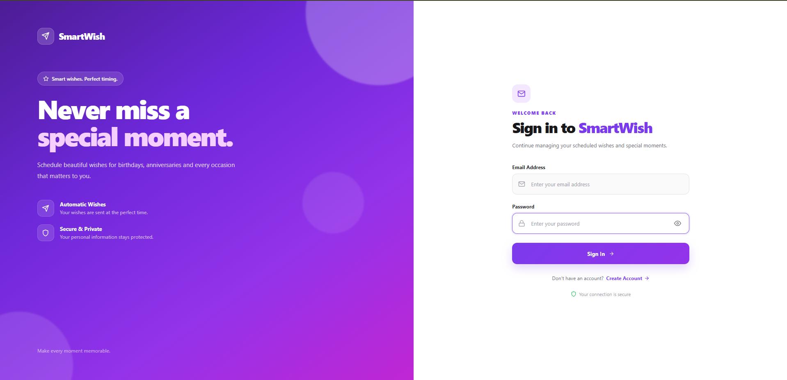
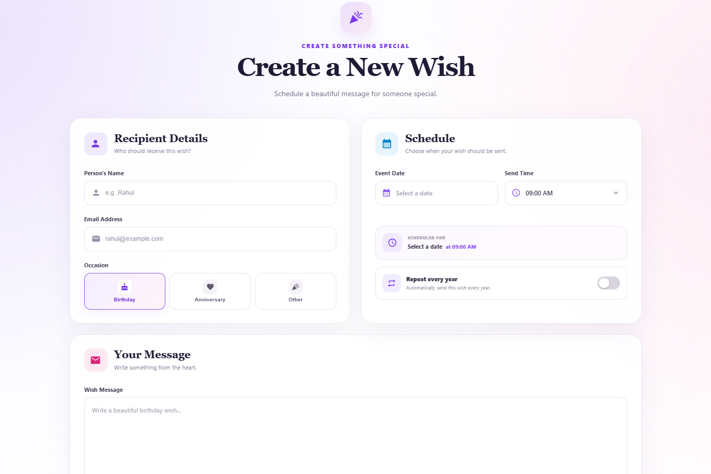
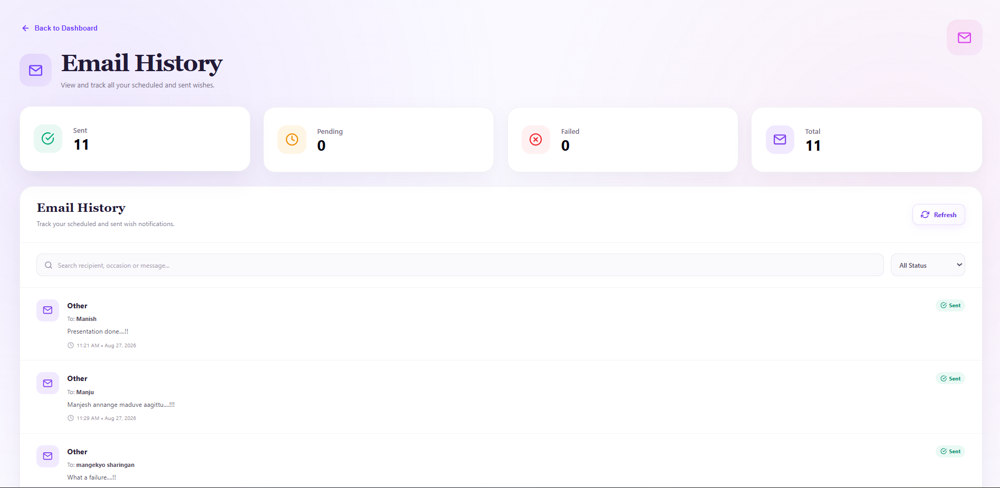

# SmartWish 🎉

SmartWish is a full-stack web application that helps users schedule personalized wishes for birthdays, anniversaries, festivals, and other special occasions.

Users can choose a recipient, set a date and time, write a custom message, and schedule the wish to be delivered automatically through email.

---

## 📸 Project Screenshots

### 🔐 Login

The login page allows users to securely access their SmartWish account.



---

### 📊 Dashboard

The dashboard provides an overview of scheduled wishes, upcoming events, and important notifications.


---

### 📅 Schedule a Wish

Users can select an occasion, recipient, date, time, and personalized message to schedule a wish.



---

### 📧 Email History

Users can view previously sent and scheduled wishes through the email history section.



---

## ✨ Features

* 🔐 User Registration and Login
* 👤 Personalized User Profile
* 🎉 Schedule Wishes for Special Occasions
* 🎂 Birthday Wish Scheduling
* 💕 Anniversary Wish Scheduling
* 🎊 Custom Occasion Scheduling
* 📅 Custom Event Date Selection
* ⏰ Custom Wish Sending Time
* 💬 Personalized Wish Messages
* ✉️ Automated Email Delivery
* 📧 Email History
* ⏰ Upcoming Scheduled Wishes
* 🔔 Notification Status
* 📱 Responsive User Interface
* ⚡ Modern and Interactive Dashboard

---

## 🔄 How SmartWish Works

```text
User
  │
  ▼
Login / Register
  │
  ▼
Create a Wish
  │
  ├── Select Recipient
  ├── Select Occasion
  ├── Select Date
  ├── Select Time
  └── Write Message
  │
  ▼
Schedule Wish
  │
  ▼
MySQL Database
  │
  ▼
Backend Scheduler
  │
  ▼
Nodemailer
  │
  ▼
Recipient Receives Email 💌
```

---

## 🛠️ Technologies Used

### Frontend

* React
* TypeScript
* Vite
* CSS
* React Icons
* React Router
* Axios

### Backend

* Node.js
* Express.js
* TypeScript
* Node-Cron
* Nodemailer

### Database

* MySQL

### Authentication & Security

* JWT Authentication
* bcrypt

### Development Tools

* Git
* GitHub
* VS Code

---

## 📂 Project Structure

```text
SmartWish/
│
├── client/
│   ├── public/
│   └── src/
│       ├── components/
│       │   ├── Dashboard/
│       │   ├── Sidebar/
│       │   ├── Login/
│       │   ├── Register/
│       │   └── ...
│       │
│       ├── App.tsx
│       └── main.tsx
│
├── server/
│   └── src/
│       ├── config/
│       ├── controllers/
│       ├── middleware/
│       ├── models/
│       ├── routes/
│       ├── services/
│       ├── app.ts
│       ├── scheduler.ts
│       └── server.ts
│
├── screenshots/
│   ├── Login.png
│   ├── Dashboard.png
│   ├── Addwish.png
│   └── email.png
│
├── .gitignore
└── README.md
```

---

## 💻 Getting Started

### 1. Frontend Setup

Navigate to the client directory:

```bash
cd client
```

Install the dependencies:

```bash
npm install
```

Start the development server:

```bash
npm run dev
```

The frontend will run on:

```text
http://localhost:5173
```

---

### 2. Backend Setup

Open a new terminal and navigate to the server directory:

```bash
cd server
```

Install the dependencies:

```bash
npm install
```

Start the backend server:

```bash
npm run dev
```

The backend will run on:

```text
http://localhost:5000
```

---

## 🗄️ Database Setup

SmartWish uses MySQL to store user accounts, scheduled wishes, and email history.

Create the database:

```sql
CREATE DATABASE smartwish;
```

Configure your database credentials in the backend environment variables.

---

## 🔐 Environment Variables

Create a `.env` file inside the `server` directory.

```env
PORT=5000

DB_HOST=localhost
DB_USER=your_database_user
DB_PASSWORD=your_database_password
DB_NAME=smartwish

EMAIL_USER=your_email@gmail.com
EMAIL_PASS=your_gmail_app_password
```

**Important:** Never upload `.env` files containing passwords, API keys, email credentials, or other secrets to GitHub.

---

## 📧 Email Scheduling

SmartWish uses a backend scheduler to check for wishes that are ready to be sent.

The application uses:

* **Node-Cron** — checks scheduled wishes.
* **MySQL** — stores scheduled events and user information.
* **Nodemailer** — sends the scheduled emails.

When a scheduled wish reaches its selected date and time, the backend processes the wish and sends the personalized email to the recipient.

---

## 🎯 Project Goals

SmartWish was created to make sending personalized wishes easier by allowing users to:

* Plan wishes in advance.
* Schedule messages for important occasions.
* Automate email delivery.
* Keep track of scheduled and sent wishes.
* Manage all wishes from a single dashboard.

---

## 🌱 Future Improvements

* ☁️ Deploy the backend to a cloud platform
* 🌐 Connect the frontend with the deployed backend
* 🔑 Add password reset functionality
* 🎨 Add customizable email templates
* 📊 Add advanced email delivery tracking
* 🔔 Add reminder notifications
* 🎁 Add greeting cards and images
* 📅 Add more recurring scheduling options
* 📱 Develop a mobile application
* 📈 Add analytics for scheduled and delivered wishes

---

## 👨‍💻 Author

**Adarsha Achary**

[GitHub](https://github.com/Adarshaachary)

---

## 📄 License

This project was developed for learning and portfolio purposes.
