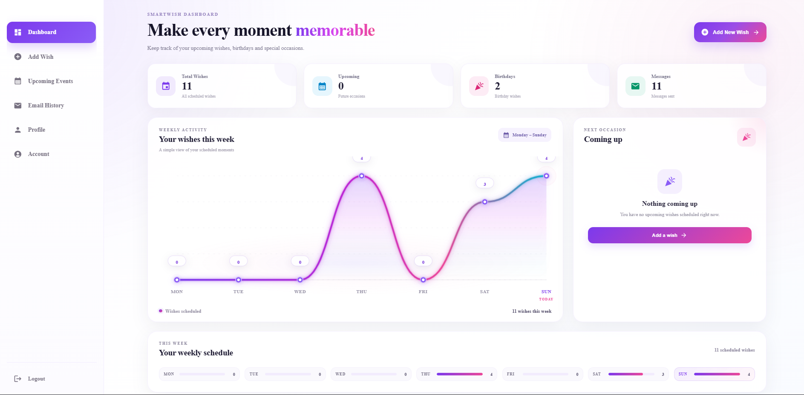

# SmartWish 🎉

SmartWish is a full-stack web application that helps users schedule personalized wishes for birthdays, anniversaries, festivals, and other special occasions.

Users can choose a recipient, set a date and time, write a custom message, and schedule the wish to be delivered automatically through email.

---

## 📸 Screenshots

### 🔐 Login


### 📝 Register


### 📊 Dashboard



### 📅 Schedule Wish


### 📧 Email History


---

## ✨ Features

- 🔐 User Registration and Login
- 👤 Personalized user profile
- 🎉 Schedule wishes for special occasions
- 📅 Select custom date and time
- ✉️ Automated email delivery
- 💬 Write personalized messages
- 📧 View email history
- ⏰ Track upcoming scheduled wishes
- 🔔 Notification status
- 📱 Responsive user interface

---

## 🛠️ Technologies Used

### Frontend

- React
- TypeScript
- CSS
- React Icons
- Vite

### Backend

- Node.js
- Express.js
- TypeScript

### Database

- MySQL

### Other Tools

- Git
- GitHub
- Nodemailer
- JWT Authentication
- bcrypt

---

## 📂 Project Structure

```text
SmartWish/
│
├── client/
│   ├── src/
│   │   ├── components/
│   │   │   ├── Dashboard/
│   │   │   ├── Sidebar/
│   │   │   ├── Login/
│   │   │   ├── Register/
│   │   │   └── ...
│   │   │
│   │   ├── App.tsx
│   │   └── main.tsx
│   │
│   └── package.json
│
├── server/
│   ├── src/
│   │   ├── app.ts
│   │   ├── server.ts
│   │   ├── routes/
│   │   ├── controllers/
│   │   └── ...
│   │
│   └── package.json
│
├── screenshots/
│   ├── Login.png
│   ├── Register.png
│   ├── Dashboard.png
│   ├── Schedule.png
│   └── EmailHistory.png
│
└── README.md